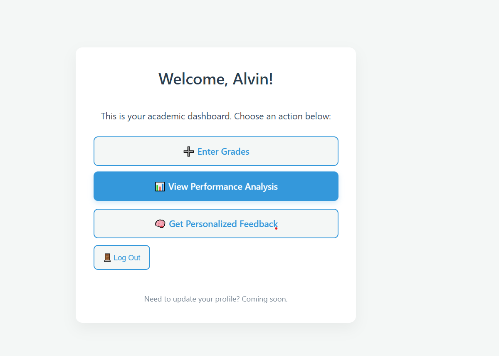

# GradeCraft
Academic performance platform that analyzes student grades, visualizes progress, and delivers personalized feedback to guide continuous improvement.

# 🎓 GradeCraft

**GradeCraft** is an AI-powered academic performance tracking platform built with Django. It helps students monitor grades, visualize academic trends, and receive personalized feedback using Microsoft's Phi model.

> ✨ “Track smarter. Understand deeper. Improve continuously.”

---

## 🚀 Features

- 🔐 **User Authentication**: Custom user model with course, semester, and year tracking.
- 📝 **Grade Input**: Record unit-level grades using letter or incomplete-based grading.
- 📊 **Performance Analysis**: Automated GPA calculation, classification, and risk detection.
- 📈 **Data Visualization**: Charts showing trends, grade distributions, and progress.
- 🤖 **AI Feedback**: Personalized academic advice powered by [Phi-3.5](https://github.com/microsoft/Phi-3.5-vision-instruct).
- 🧠 **Modular Design**: Each app is cleanly separated: users, grades, analysis, feedback.

---

## 🛠 Tech Stack

- **Framework**: Django 5.2
- **Database**: SQLite (dev)
- **Frontend**: HTML/CSS (custom) (for visualizations)
- **AI Integration**: Microsoft Phi API via Azure GitHub Inference
- **Deployment**: Render (recommended), GitHub Actions for CI

---

## 🧪 Run Locally

```bash
git clone https://github.com/yourusername/GradeCraft.git
cd GradeCraft
python -m venv .venv
source .venv/bin/activate  # or .venv\Scripts\activate on Windows
pip install -r requirements.txt
cp .env.example .env  # Add your secrets like GITHUB_TOKEN here
python manage.py migrate
python manage.py runserver

## 📸 Screenshots

### Dashboard


### Grade Tracker


